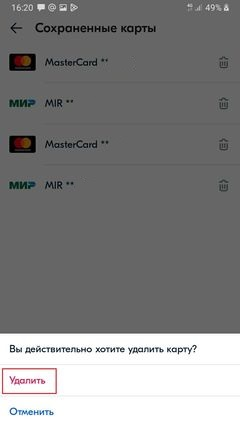

# Как привязать или удалить банковскую карту в мобильном приложении Ozon

Чтобы привязать или удалить банковскую карту в мобильном приложении Ozon, выполните следующие действия:

1. Перейдите в личный кабинет, нажав на иконку в правом нижнем углу экрана:

2. Перейдите в раздел управления аккаунтом, нажав на блок в верхней части экрана:

3. Нажмите «Сохраненные карты»:

4. Для добавления карты нажмите «Добавить карту»:

5. Введите данные карты (номер, срок действия и CVV/CVC) в появившемся окне:

6. Нажмите «Привязать».

7. Подтвердите привязку карты с помощью СМС.

В результате данная карта будет привязана к приложению.

8. Для удаления какой-либо карты из списка нажмите на значок корзины рядом с ней.

9. Подтвердите удаление. 

В результате данная карта будет удалена.

